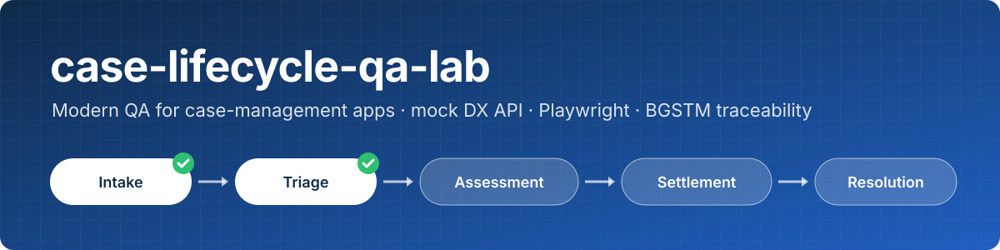
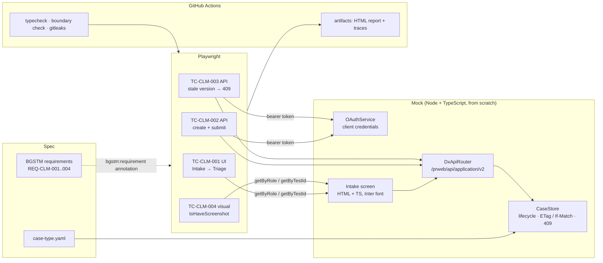
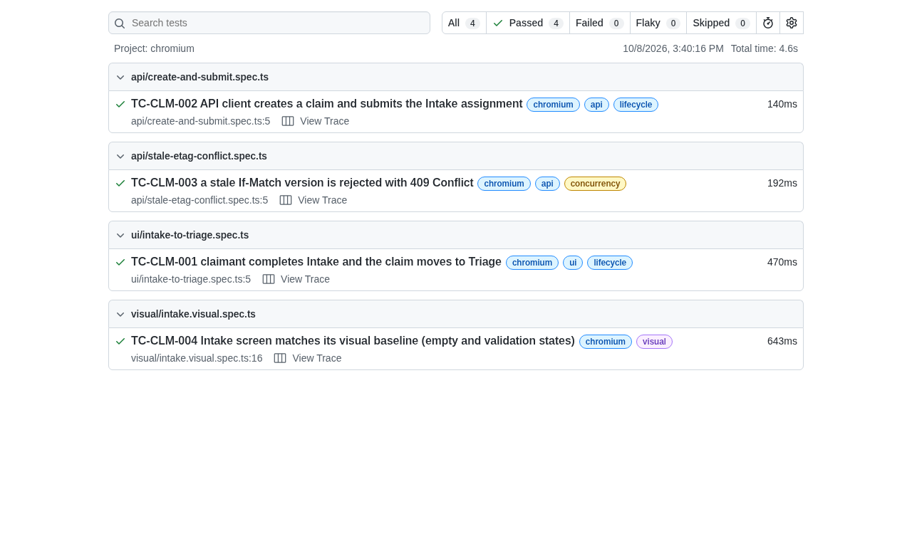
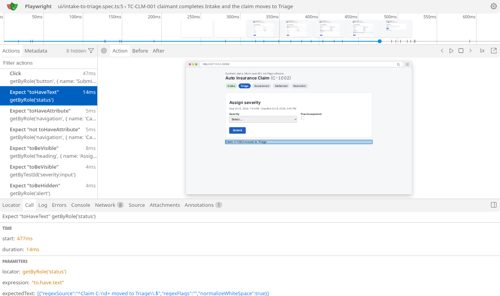

<p align="center">
  
</p>

<p align="center">
  <a href="https://github.com/bg-playground/case-lifecycle-qa-lab/actions/workflows/ci.yml"></a>
  <a href="LICENSE"></a>
  <a href="https://playwright.dev"></a>
  <a href="https://github.com/bg-playground/case-lifecycle-qa-lab/blob/main/tsconfig.json"></a>
</p>

<p align="center"><em>Modeled on Pega Platform public DX API docs.</em></p>

**Case-management apps fail in the gaps between stages: a submit that silently loses someone else's edit, a button with no stable hook, a screen that drifts after an upgrade.** This repo shows a modern QA approach to exactly those gaps, end to end and with nothing to install but Node:
- **The case lifecycle is data:** a handwritten case-type YAML.
- **The backend is a small typed mock** of a case API, with real optimistic locking (ETag/If-Match → 409).
- **The UI is accessible on purpose,** so tests use role and test-ID locators instead of brittle IDs.
- **Every test traces to a [BGSTM](https://github.com/bg-playground/BGSTM) requirement.**
- **CI proves it on every push** with traces, an HTML report, a visual-diff baseline, a boundary check and gitleaks.

> **Mock, written from scratch.** Everything here was written for this repo and runs against the mock. It contains **no Pega software, no Pega code, no Pega exports (rules, RAP/JAR, Blueprint outputs), no Pega UI screenshots, and no `@pega` npm packages.** It follows only publicly documented *shapes and conventions*: the top-level DX API response structure, `eTag`/`If-Match` optimistic locking, and the `data-testid="<testId>:input"` test-ID pattern. All screenshots in this README are of this repo's own mock screen.

## Quickstart

```bash
npm ci
npx playwright install chromium
npx playwright test          # starts the mock, runs 4 tests, writes playwright-report/
```

Then `npx playwright show-report` opens the HTML report, and every test has a trace.

## The case lifecycle

[`apps/claim/case-type.yaml`](apps/claim/case-type.yaml) describes a synthetic Auto Insurance Claim: stages, steps, five data objects, forms with test IDs, SLAs and reference data.

```mermaid
stateDiagram-v2
  direction LR
  [*] --> Intake
  state Intake {
    direction LR
    CollectIncidentDetails: Collect incident details (assignment, SLA 2h / 24h)
    VerifyPolicy: Verify policy (automated)
    CollectIncidentDetails --> VerifyPolicy
  }
  Intake --> Triage
  state Triage {
    direction LR
    AssignSeverity: Assign severity (assignment, SLA 4h / 24h)
    Route: Route (decision)
    AssignSeverity --> Route
  }
  Triage --> Assessment: otherwise
  Triage --> FraudReview: severity High or fraud suspected
  FraudReview: Fraud Review (alternate stage)
  FraudReview --> Assessment: not confirmed
  FraudReview --> Resolution: confirmed, Resolved-Rejected
  Assessment: Assessment (adjuster review, estimate, SLA 3d / 5d)
  Assessment --> Settlement
  Settlement: Settlement (approve payout, manager approval over 10,000)
  Settlement --> Resolution
  Resolution: Resolution (Resolved-Approved / Rejected / Withdrawn)
  Resolution --> [*]
```



The mock runs the primary path (Intake → Triage → Assessment → Settlement → Resolution) and the automated policy check. The Fraud Review routing and the escalations are declared for the planned generator (see [Roadmap](#roadmap)).

## Test architecture



## BGSTM traceability

IDs follow BGSTM's worked-example convention (`REQ-<AREA>-NNN` → `TC-<AREA>-NNN`, area `CLM` = claims). Each test carries one Playwright annotation, `{ type: 'bgstm:requirement', description: 'REQ-CLM-00n' }`. That's the convention read by the BGSTM reporter in [bgstm-playwright-frameworks](https://github.com/bg-playground/bgstm-playwright-frameworks), which forwards it as `requirement_external_ids` under BGSTM's External Results v1 spec.

| Requirement | Statement | Test case | Spec | What it checks |
|---|---|---|---|---|
| REQ-CLM-001 | A claimant can complete Intake on the web screen, and the claim moves to Triage with the stage indicator updated. | TC-CLM-001 | [`tests/ui/intake-to-triage.spec.ts`](tests/ui/intake-to-triage.spec.ts) | `getByTestId('…:input')`, `getByRole('textbox' / 'button' / 'navigation' / 'status')`, `getByLabel`; stage marker moves; next assignment shown |
| REQ-CLM-002 | An API client using OAuth 2.0 client credentials can create a claim, open its first assignment, and submit it with the current version, advancing the case to Triage. | TC-CLM-002 | [`tests/api/create-and-submit.spec.ts`](tests/api/create-and-submit.spec.ts) | 401 without a token; 201 + `ETag`; stage list; SLA present; 200 on submit with a new `ETag` |
| REQ-CLM-003 | An update with a stale version is rejected with 409 Conflict and changes nothing; an update with no version is refused; a retry with the current version succeeds. | TC-CLM-003 | [`tests/api/stale-etag-conflict.spec.ts`](tests/api/stale-etag-conflict.spec.ts) | two users; save → new version; stale submit 409; missing `If-Match` 428; state unchanged; retry 200 |
| REQ-CLM-004 | The Intake screen's layout does not regress, in both its empty and validation-error states. | TC-CLM-004 | [`tests/visual/intake.visual.spec.ts`](tests/visual/intake.visual.spec.ts) | `toHaveScreenshot` against committed Linux/Chromium baselines; fixed viewport, locale and timezone; bundled font; case ID and SLA masked |

How this maps to BGSTM's [six phases](https://bg-playground.github.io/BGSTM/phases/):
1. **Planning:** the requirements.
2. **Case development:** the four test cases.
3. **Environment preparation:** a self-starting mock, so there's no shared environment to book.
4. **Execution:** Playwright, locally and in CI.
5. **Analysis:** traces and the HTML report.
6. **Reporting:** the CI artifacts, with annotations ready for a BGSTM server.

The BGSTM reporter itself isn't wired in yet, because the `@bgstm/*` packages aren't published to npm.

## Sample output (from the mock)

The HTML report from a local run of the four tests:



The trace of TC-CLM-001, with the "claim moved to Triage" check selected. The DOM snapshot is this repo's mock Intake screen.



To regenerate these images (and `docs/assets/social-preview.png`), run `CI=true npx playwright test && npm run docs:assets`.

## Mock API reference

| Method | Path | Notes |
|---|---|---|
| POST | `/prweb/PRRestService/oauth2/v1/token` | `grant_type=client_credentials`; client auth via HTTP Basic or `client_id`/`client_secret` ([RFC 6749 §4.4](https://www.rfc-editor.org/rfc/rfc6749#section-4.4)). The mock client `claims-qa-client` / `not-a-real-secret` is a placeholder, not a secret. |
| POST | `/prweb/api/application/v2/cases` | `{ "caseTypeID": "Synthetic-Claims-Work-AutoClaim", "content": {} }` → 201 with `ETag`, `data.caseInfo`, `uiResources`, `nextAssignmentInfo` |
| GET | `/prweb/api/application/v2/cases/{caseID}` | Current case and `ETag` |
| GET | `/prweb/api/application/v2/assignments/{assignmentID}` | Open assignment, form metadata and `ETag` |
| PATCH | `/prweb/api/application/v2/assignments/{assignmentID}/actions/{actionID}` | Submit. `If-Match` is required: missing → 428, stale → **409**, invalid fields → 422, success → 200 with a new `ETag` |
| PATCH | `…/actions/{actionID}/save` | Save without advancing (new `ETag`) |
| POST | `/mock-portal/session` | Mock stand-in for a portal login, used only by the demo screen |

Every `/api/application/v2` call needs `Authorization: Bearer <token>` (401 otherwise). The top-level response structure (`data`, `uiResources`, `nextAssignmentInfo`, `confirmationNote`) and the `eTag`/`if-match` behaviour follow Pega Academy's public [Constellation DX API](https://academy.pega.com/topic/constellation-dx-api/v2) topic. Inner field names, ID formats, error bodies and the 428 status are this mock's own approximations. See also the public [DX API differences page](https://docs.pega.com/bundle/dx-api/page/platform/dx-api/differences-between-v1-v2.html). The Submit button deliberately has no test ID, mirroring a [documented Constellation gap](https://support.pega.com/support-doc/missing-data-test-id-attributes-in-constellation-during-automation-testing), so the UI test shows the role-based fallback.

## Guardrails: boundary check and gitleaks

`scripts/boundary_check.ts` runs in CI and in `scripts/ci_local.sh`. It fails on:
- **Private terms** (private repo names, codenames and similar), including their SHA-256 hashes. These terms are **not stored in this repo in any form.** They're read at run time from the `BOUNDARY_PRIVATE_TERMS` GitHub Actions secret in CI. Locally they come from the `BOUNDARY_PRIVATE_TERMS` env var, a file named by `BOUNDARY_PRIVATE_TERMS_FILE`, or a git-ignored `.boundary-private-terms` file. Findings never print the term.
- **Emails** not on a reserved `.example` / `.invalid` domain.
- **URLs** whose host isn't allowlisted.
- **Local workspace paths and Pega trial hostnames.**
- **`@pega/` packages** in `package.json` or `package-lock.json`.

**Fail-closed policy:**
- **Missing terms fail the run:** on pushes, manual runs, same-repo pull requests and local runs.
- **Pull requests from forks can't read secrets,** so the workflow sets `BOUNDARY_REQUIRE_PRIVATE_TERMS=false` for them. The check then prints a loud `::warning::` and runs the generic rules only.
- **Contributors without the terms** can run locally the same way.

**Exemptions** live in [`boundary/allowlist.json`](boundary/allowlist.json), each with a reason. The allowed hosts are the public Pega docs, Academy, support and www sites, `github.com`, `bg-playground.github.io`, `playwright.dev`, `docs.github.com`, `www.rfc-editor.org`, `img.shields.io`, and localhost for the mock. `package-lock.json` skips only the email and URL checks (registry tarball URLs). `--self-test` plants one sample per rule, including a run-time canary term and its hash, and checks that each is caught.

gitleaks (v8.30.1, checksum-verified in CI) runs with its default rules ([`.gitleaks.toml`](.gitleaks.toml)) over the working tree and the full git history.

## Run everything CI runs

```bash
bash scripts/ci_local.sh                     # npm ci, browsers, typecheck, boundary, gitleaks, tests
SKIP_INSTALL=1 GITLEAKS_BIN=/path/to/gitleaks BOUNDARY_PRIVATE_TERMS_FILE=/path/to/terms.txt bash scripts/ci_local.sh
npm run start:mock                           # mock + Intake screen on http://127.0.0.1:3333
```

To refresh the visual baselines after an intended UI change, run `npx playwright test tests/visual --update-snapshots`. Baselines are Linux/Chromium. The page uses the bundled Inter font (OFL-1.1, from `@fontsource/inter`), so rendering doesn't depend on system fonts.

## Roadmap

1. **Lifecycle test generation.** Generate tests from `case-type.yaml`: one happy path per resolution status, the Fraud Review route, SLA-boundary checks with a mocked clock, and a 409 test per assignment. Each generated test is tagged with its requirement.
2. **Upgrade-regression diff.** Inventory every test ID, role and accessible name on each screen and diff two versions of the UI. This would be demonstrated with two mock variants that copy the documented Constellation test-ID changes (non-unique nav links, action buttons gaining IDs).
3. **More visual diffs.** Cover each stage's screen, with masks and per-state baselines.

Later:
- a `domain-case-management` pack for bgstm-playwright-frameworks;
- the BGSTM reporter wired to a BGSTM server in CI;
- AI-assisted locator repair with typed, calibrated confidence (needs a go-ahead and budget).

### Future work: the manual, opt-in live lane

Planned, not built:
- **Trigger:** a separate `live-pega.yml` workflow with `workflow_dispatch` only. It would run the API tests (and later the UI test) against **B Gee's own Pega Platform Community Edition trial**.
- **Secrets:** credentials in a protected GitHub Environment with a required reviewer.
- **Expiry:** a preflight that **skips with a neutral result** when the trial is powered down or expired.
- **Artifacts:** traces, HAR files and screenshots from live runs stay **private**.
- **Gate:** the lane stays off until the trial terms and Pega's written position on screenshots and video are settled. Public CI never depends on a live Pega instance.

## Limitations

- **It's a mock.** Field names, IDs, error bodies and the 428 status are approximations. Real Pega behaviour (authentication flows, response details, '25 vs '26 differences) hasn't been tested.
- **Only the primary path runs.** Routing to Fraud Review and the escalations are declared in the YAML but not executed. The tests cover Intake → Triage.
- **State is in memory and lost on restart.** The mock portal session hands the browser a token without a login; that's a stand-in, not a pattern for real apps.
- **Coverage gaps:** one browser (Chromium), no accessibility scan yet, and visual baselines exist only for Linux.

## Trademarks and disclaimer

Pegasystems, Pega, and the Pega logo are trademarks or registered trademarks of Pegasystems Inc. and/or its affiliates. All other trademarks are the property of their respective owners.

This project is independent. It is **not affiliated with, sponsored by, or endorsed by Pegasystems Inc.** No Pega software, code, documentation text, exports or screenshots are included, and no Pega logo is used. Product names are used only to describe what the mock is modeled on, in line with Pega's public [trademark guidelines](https://www.pega.com/about/media-resources/trademark-guidelines). All data is synthetic: names are invented, emails use `.example`, and phone numbers use 555-01xx.

## License

[MIT](LICENSE), Copyright (c) 2026 B Gee.
